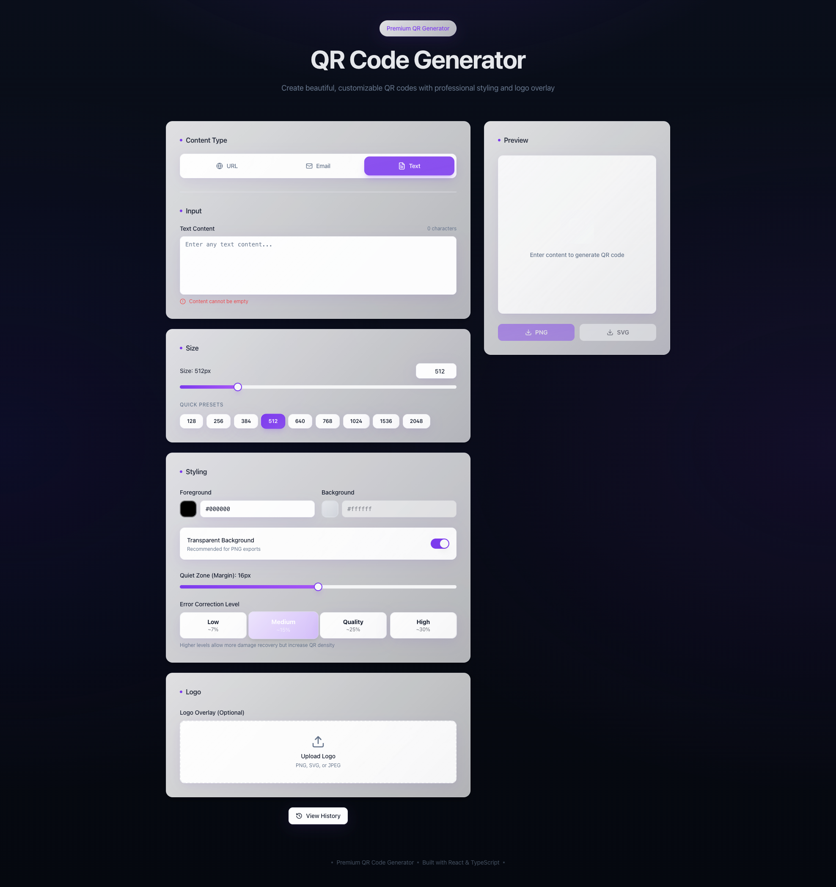

# QR Code Generator



## Overview
A premium QR creation experience built with React, Vite, and TypeScript. Customize payloads (URL, email, or text), branding, logo overlays, and export pixel-perfect codes as SVG or PNG with toast-backed feedback and a local history of previous designs.

## Features
- **Content-aware inputs** – switch between URL, email, and plain-text modes with contextual validation.
- **Brand styling** – live controls for foreground/background colors, transparent PNG backgrounds, quiet-zone margins, and QR error-correction presets.
- **Responsive sizing** – slider + presets support exports from 128px up to 4096px, plus manual entry for precise needs.
- **Logo overlay** – upload logos, tweak scale, corner radius, and optional safety rings before compositing directly into the SVG.
- **Export & history** – download SVG/PNG, copy SVG markup, and persist up to 20 past configurations for quick restoration.

## Tech Stack
- [Vite](https://vitejs.dev/) + React 18 + TypeScript
- [Tailwind CSS](https://tailwindcss.com/) + shadcn/ui components
- [Zustand](https://github.com/pmndrs/zustand) for persisted app state
- [React Query](https://tanstack.com/query) scaffolding for future data hooks
- [react-router-dom](https://reactrouter.com/) for routing and 404 handling
- [qrcode](https://github.com/soldair/node-qrcode) for SVG generation and custom export utilities

## Project Structure
```
.
├── public/               # Static assets served as-is
├── screenshots/          # UI captures referenced by the README
├── src/
│   ├── components/       # Input panels, preview card, history modal, shadcn/ui atoms
│   ├── hooks/            # Reusable client hooks
│   ├── lib/              # QR helpers (payload building, export helpers)
│   ├── pages/            # Route-level views (Home, NotFound)
│   ├── state/            # Zustand store with persistence + history
│   └── main.tsx          # Entry point wiring providers
└── vite.config.ts        # Vite + Tailwind configuration
```

## Getting Started
1. **Install dependencies:** `npm install`
2. **Run the dev server:** `npm run dev`
   - Vite defaults to http://localhost:5173. Pass `--host` to expose on your LAN.
3. **Lint before committing:** `npm run lint`

## Available Scripts
- `npm run dev` – start the Vite development server with HMR.
- `npm run build` – create an optimized bundle in `dist/`.
- `npm run build:dev` – production build that retains development mode settings for debugging.
- `npm run preview` – serve the build output locally.
- `npm run lint` – run ESLint using `eslint.config.js`.

## QR Creation Workflow
1. Pick a content type via the **Content Type** pills and fill in the contextual form.
2. Adjust **Size** using the slider or quick presets; use manual entry for extra-large exports.
3. Style the QR with brand colors, quiet-zone margins, transparency, and error-correction level.
4. Optionally upload a logo, then fine-tune scale, corner radius, and the safety ring.
5. Use the preview column to download PNG/SVG, copy SVG markup, or fire the history modal to revisit past designs.

## Testing & QA
Automated tests are not yet included. When contributing, verify changes manually across:
- `npm run dev` for live editing and validation messages.
- `npm run preview` for production parity.
- PNG + SVG exports at multiple sizes, including with/without logos.
